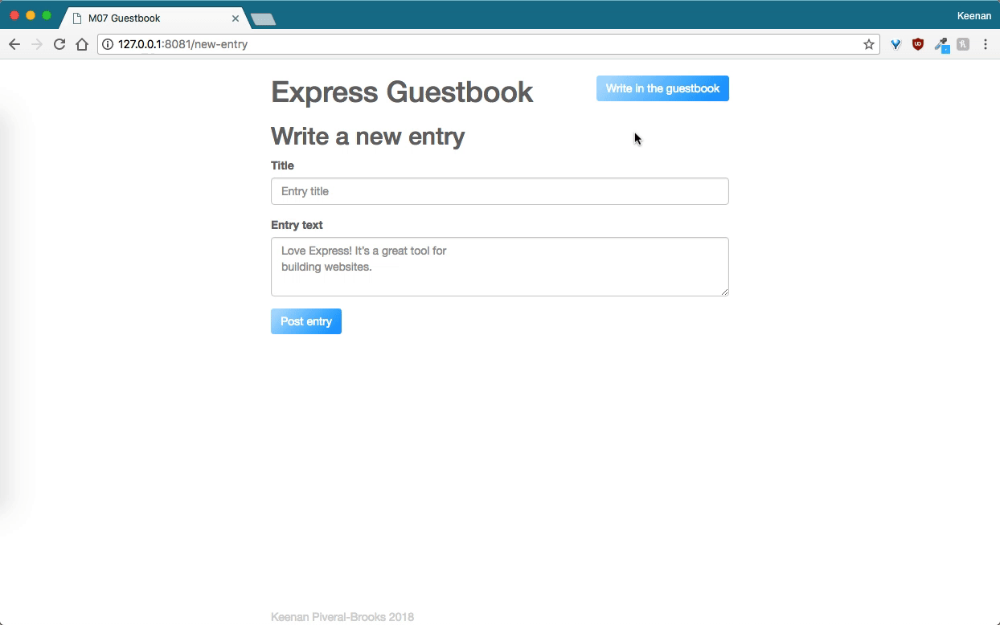

# M07 Guestbook Example

A simple guest book using Node, Express, BootStrap, EJS

## How to use

Open a terminal window in the cloned  repo folder.

Run npm install to install all the dependencies in the package.json file.

Run `$ node gbapp.js` to start the server.  (Hit CTRL-C to stop.)

```
$ npm install
$ node gbapp.js
```

Point your browser to `http://localhost:8081`.

## In action

